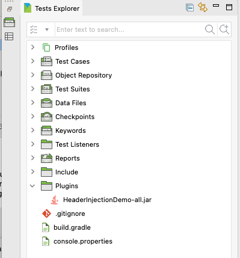
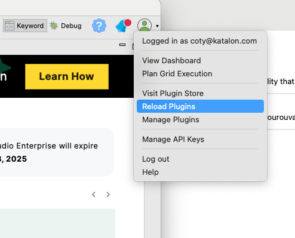
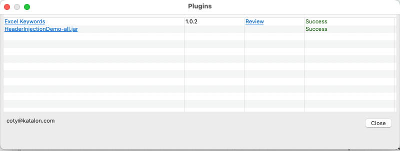

# Katalon Studio Custom Headers Plugin
Katalon Studio plugin to enable setting custom headers in web requests.


**Installation Options**
---

1. Download the plugin jar file from the [latest release](https://github.com/katalon-studio/katalon-studio-custom-headers-keywords-plugin/releases) and place it in the Plugins directory of your Katalon Studio installation:



2. Reload the plugins in Katalon Studio by selecting `Plugin > Reload Plugins` from the main menu:



3. You should see the plugin listed in the resulting dialog:



**Usage**
---

1. Install the plugin as described above.
2. Use the plugin method openBrowserWithCustomHeaders() in your test case to open a browser with custom headers.
   1. Headers are specified as a map of key-value pairs.
   2. Headers can include any valid HTTP headers, including User-Agent, Accept-Language, etc. It will replace existing headers with the same key.
   3. The method updates the active WebDriver instance that is used with WebUI keywords.
3. Proceed to use WebUI keywords as usual.

```groovy
import static com.kms.katalon.core.checkpoint.CheckpointFactory.findCheckpoint
import static com.kms.katalon.core.testcase.TestCaseFactory.findTestCase
import static com.kms.katalon.core.testdata.TestDataFactory.findTestData
import static com.kms.katalon.core.testobject.ObjectRepository.findTestObject
import static com.kms.katalon.core.testobject.ObjectRepository.findWindowsObject
import com.kms.katalon.core.checkpoint.Checkpoint as Checkpoint
import com.kms.katalon.core.cucumber.keyword.CucumberBuiltinKeywords as CucumberKW
import com.kms.katalon.core.mobile.keyword.MobileBuiltInKeywords as Mobile
import com.kms.katalon.core.model.FailureHandling as FailureHandling
import com.kms.katalon.core.testcase.TestCase as TestCase
import com.kms.katalon.core.testdata.TestData as TestData
import com.kms.katalon.core.testng.keyword.TestNGBuiltinKeywords as TestNGKW
import com.kms.katalon.core.testobject.TestObject as TestObject
import com.kms.katalon.core.webservice.keyword.WSBuiltInKeywords as WS
import com.kms.katalon.core.webui.keyword.WebUiBuiltInKeywords as WebUI
import com.kms.katalon.core.windows.keyword.WindowsBuiltinKeywords as Windows
import internal.GlobalVariable as GlobalVariable
import org.openqa.selenium.Keys as Keys

CustomKeywords.'com.katalon.plugin.keyword.CustomWebDriver.openBrowserWithHeaders'([('foo') : 'bar', ('user-agent') : 'MyCustomAgent'])

WebUI.navigateToUrl('https://httpbin.org/headers')

WebUI.delay(5)

WebUI.closeBrowser()
```

**Limitations**
---

1. The plugin requires the ability to install unbundled plugins into Chrome. This may not be possible in some environments. This will be fixed in a future release of Katalon Studio.
2. The plugin currently only works with the Chrome browser. This will be fixed in a future release of the plugin.
3. The plugin currently overrides some other WebUI functionality including Smart Wait and Smart Locators. This will be fixed in a future release of the plugin.
4. ~~The plugin does not currently show up as an option in Manual mode. This will be fixed in a future release of the plugin.~~